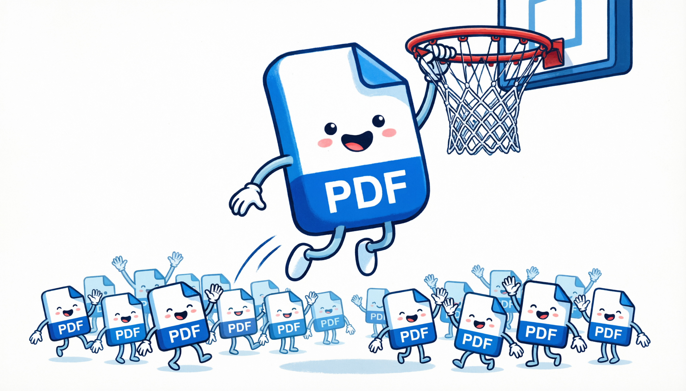
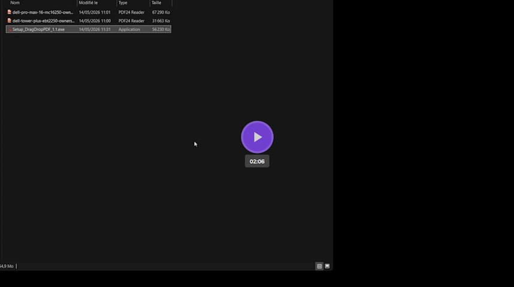
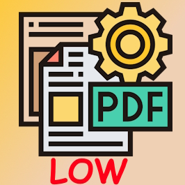
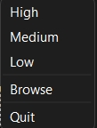

# DragDropPDF

<p align="center">
  
  <br>
  <a href="https://github.com/yann83/DragDropPDF/releases/latest"></a>
  
</p>


A small gesture, a big support! Buy me a coffee ☕ if you appreciate my work. Thanks in advance!

[](https://www.buymeacoffee.com/yann83)

## Licence

AGPL-3.0 licence is needed to add Ghostscript binary to DragDropPdf setup package

## About

Litte program that display a square on your destop, you can drag'n drop pdf files on it to reduce the size. You chan choose between 3 modes and change their settings for your needs.
It work with Ghostsript under AGPL-3.0 licence

Here a short presentation :
<br>

[](https://app.videas.fr/3ed42fc1-4e73-4ce1-ae06-386d6335bea5/)

## Installation

Run the setup

## Use it with python

Work with python 3.10

You'll need Ghostscript binary (unzip the setup) in `bin` folder

 - gsdll64.dll
 - gsdll64.lib
 - gswin64.exe
 - gswin64c.exe

> git clone https://github.com/yann83/DragDropPDF.git

> pip install -r requirements.txt

then run `interface.py` main

**About Ghostscript** : I use this version : [github.com/ArtifexSoftware/ghostpdl-downloads/releases/tag/gs10050](https://github.com/ArtifexSoftware/ghostpdl-downloads/releases/tag/gs10050)

Download `gs10050w64.exe` then extract the `bin` folder content with 7zip for exemple.


## How to Use

Right click on on the square



you can choose between 3 levels of compression :

 - HIGH for highest quality
 - LOW for lowest quality
 


From the contextual menu you can choose the output folder.

## Avanced configuration

you can edit the config.json file.

You will find the config.json file in the same location as the `DragDropPDF` executable

Here the default `config.json` content.

`base_args` value is a list with Ghostscript default parameters for all profiles.<br>
Then you'll find `high`, `medium` and `low` profiles parameters. Each one have custom [Ghostscript parameters](https://ghostscript.readthedocs.io/en/latest/index.html).


```json
{
  "path": "C:/temp",
  "base_args": [
    "-sDEVICE=pdfwrite",
    "-dNOPAUSE",
    "-dQUIET",
    "-dBATCH",
    "-dCompatibilityLevel=1.4"
  ],
  "pics": {
    "high": "pdf.jpg",
    "medium": "pdfmedium.jpg",
    "low": "pdflow.jpg"
  },
  "current": {
    "low": "pdflow.jpg"
  },
  "high": {
    "dPDFSETTINGS": "/printer"
  },
  "medium": {
    "dPDFSETTINGS": "/ebook",
    "sColorConversionStrategy": "Gray",
    "dProcessColorModel": "/DeviceGray"
  },
  "low": {
    "dPDFSETTINGS": "/screen",
    "sColorConversionStrategy": "Gray",
    "dProcessColorModel": "/DeviceGray"
  }
}
```